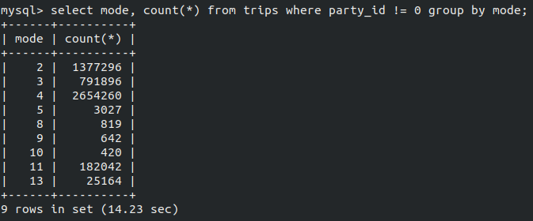
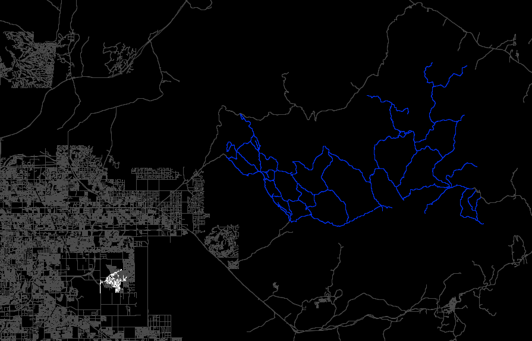

# Icarus Project Bugs

## Unresolved and Impeding

*Bug is not fixed and no work arounds are known.*

---

## Unresolved and Circumvented

*Bug is not fixed but is being circumvented temporarily.*

### 004: Nonvehicle Parties



- as this query result reveals, there are parties defined for trips are not vehicular modes
- this sorta makes sense; there exists groups that travel together walking or in transit
- it would be realistic to make these parties route together, but it would complicate the vehicle system I have in MATSim already
- I am going to neglect that these parties exist; their trips will be routed seperately

---

## Solved and Pending Implementation

*Bug solution found but implementation is in progress.*

### 002: Null Pointer on PlanRouter

```term
2019-12-17 12:16:18,069  WARN AStarEuclidean:171 finding totalCost=0.0; this will often (or always?) lead to a null pointer exception later.  In my own case, it was related to a network having freespeed infinity at places.  kai, jan'18
2019-12-17 12:16:18,116 ERROR AbstractMultithreadedModule$ExceptionHandler:210 Thread PlanRouter.19 died with exception. Will stop after all threads finished.
java.lang.NullPointerException
    at org.matsim.core.router.AStarEuclidean.addToPendingNodes(AStarEuclidean.java:176)
    at org.matsim.core.router.Dijkstra.relaxNodeLogic(Dijkstra.java:423)
    at org.matsim.core.router.Dijkstra.relaxNode(Dijkstra.java:394)
    at org.matsim.core.router.AStarLandmarks.relaxNode(AStarLandmarks.java:138)
    at org.matsim.core.router.Dijkstra.searchLogic(Dijkstra.java:318)
    at org.matsim.core.router.Dijkstra.calcLeastCostPath(Dijkstra.java:237)
    at org.matsim.core.router.AStarLandmarks.calcLeastCostPath(AStarLandmarks.java:125)
    at org.matsim.core.router.NetworkRoutingModule.calcRoute(NetworkRoutingModule.java:95)
    at org.matsim.core.router.TripRouter.calcRoute(TripRouter.java:200)
    at org.matsim.core.router.PlanRouter.run(PlanRouter.java:90)
    at org.matsim.core.replanning.modules.AbstractMultithreadedModule$PlanAlgoThread.run(AbstractMultithreadedModule.java:234)
    at java.base/java.lang.Thread.run(Thread.java:834)
```

- as the custom exception handling suggests, this is related to having infinite freespeed on the network
- it appears that when pt2matsim generates custom links to resolve transit routes, it can assign an infinite freesped to links
- setting "scaleMaxSpeed" to true does not fix this issue as expected
- best fix for now is to replace the freespeed of links with infinity to a reasonable upper threashold
- the impact of this on routing is not known, but it should only impact transit routing since mode chaging is disabled

```bash
sed -i 's/freespeed=\"Infinity\"/freespeed=\"40.0\"/g' network.xml
```

---

## Solved and Implemented

*Bug solved and implemented; no longer an issue.*

### 0003: Incorrectly Trimmed Network



- the white links are links that can be traveled by walking modes and the blue links are those that can be traveled by biking modes; the remainder are vehicular only links
- obviously this is not correct; most of maricopa county should be navigatable by foot
- this happened because the default way parameters were not defined correctly on the multimodial network generator
- default way parameters are defined for each parameter type, not each routable subnetwork

---

### 001: Shared Vehicle Teleportation Exception

```term'
2019-12-17 11:47:41,285  INFO VehicularDepartureHandler:110 teleport vehicle car-1260601 from link 763032 to link 763032
2019-12-17 11:47:41,989  INFO Gbl:191 Thread performance: Thread=class org.matsim.core.events.SimStepParallelEventsManagerImpl$ProcessEventsRunnable0  cpu-time=4.28125sec
2019-12-17 11:47:41,989 ERROR AbstractController:209 Mobsim did not complete normally! afterMobsimListeners will be called anyway.
java.lang.RuntimeException: Could not remove parked vehicle with id car-1260601 on the link id 763032.  Maybe it is currently used by someone else? (In which case ignoring this exception would lead to duplication of this vehicle.) Maybe was never placed onto a link?
    at org.matsim.core.mobsim.qsim.qnetsimengine.VehicularDepartureHandler.teleportVehicleTo(VehicularDepartureHandler.java:120)
    at org.matsim.core.mobsim.qsim.qnetsimengine.VehicularDepartureHandler.handleCarDeparture(VehicularDepartureHandler.java:85)
    at org.matsim.core.mobsim.qsim.qnetsimengine.VehicularDepartureHandler.handleDeparture(VehicularDepartureHandler.java:56)
    at org.matsim.core.mobsim.qsim.QSim.arrangeAgentDeparture(QSim.java:472)
    at org.matsim.core.mobsim.qsim.QSim.arrangeNextAgentAction(QSim.java:434)
    at org.matsim.core.mobsim.qsim.QSim.access$000(QSim.java:101)
    at org.matsim.core.mobsim.qsim.QSim$1.arrangeNextAgentState(QSim.java:154)
    at org.matsim.core.mobsim.qsim.ActivityEngineDefaultImpl.doSimStep(ActivityEngineDefaultImpl.java:115)
    at org.matsim.core.mobsim.qsim.QSim.doSimStep(QSim.java:389)
    at org.matsim.core.mobsim.qsim.QSim.run(QSim.java:259)
    at org.matsim.core.controler.NewControler.runMobSim(NewControler.java:126)
    at org.matsim.core.controler.AbstractController$8.run(AbstractController.java:198)
    at org.matsim.core.controler.AbstractController.iterationStep(AbstractController.java:230)
    at org.matsim.core.controler.AbstractController.mobsim(AbstractController.java:194)
    at org.matsim.core.controler.AbstractController.iteration(AbstractController.java:145)
    at org.matsim.core.controler.AbstractController.doIterations(AbstractController.java:113)
    at org.matsim.core.controler.AbstractController.access$100(AbstractController.java:29)
    at org.matsim.core.controler.AbstractController$1.run(AbstractController.java:80)
    at org.matsim.core.controler.MatsimRuntimeModifications.run(MatsimRuntimeModifications.java:69)
    at org.matsim.core.controler.MatsimRuntimeModifications.run(MatsimRuntimeModifications.java:52)
    at org.matsim.core.controler.AbstractController.run(AbstractController.java:88)
    at org.matsim.core.controler.NewControler.run(NewControler.java:84)
    at org.matsim.core.controler.Controler.run(Controler.java:247)
    at org.matsim.run.Controler.run(Controler.java:56)
    at org.matsim.run.Controler.main(Controler.java:60)
```

- simulation fails when attempting to teleport a vehicle that already has an agent in it
- best fix is to change "vehicleBehavior" (qsim setting) from "teleport" to "wait" for vehicle defined iterations
- this fix may negatively impact the learning rate of the simulation
